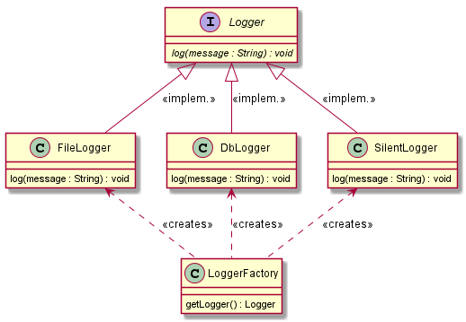
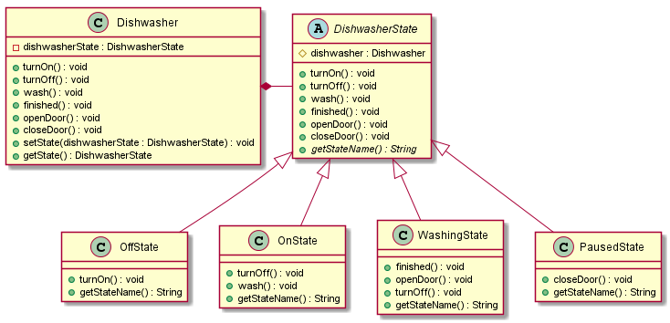

# Design Pattern Katas für Java #

## Worum handelt es sich hier? ##

### Code Katas ###

Unter einem **Code Kata** versteht man eine kleine, abgeschlossene Übung, mit der Softwareentwickler ihre Fertigkeiten 
trainieren können. Der Begriff stammt aus der [asiatischen Kampfkunst](https://de.wikipedia.org/wiki/Form_(Kampfkunst)). 
Ausführliche Informationen zu Code Katas finden sich [hier](http://codekata.com/). 

### Design Patterns ###

Bei [**Design Patterns**](https://de.wikipedia.org/wiki/Entwurfsmuster) (deutsch _Entwurfsmuster_) handelt es sich laut 
Wikipedia um bewährte Lösungsschablonen für wiederkehrende Entwurfsprobleme in der Softwareentwicklung.

**Literaturempfehlungen**:
* Einen guten und leicht verständlichen Einstieg in das Thema Design Patterns (sowie objektorientierte 
Design-Prinzipien allgemein) gibt das Buch _"Entwurfsmuster von Kopf bis Fuß"_ von Eric Freeman und Elisabeth Robson, 
erschienen im O'Reilly-Verlag. 
* Eine abstraktere Behandlung findet sich im Klassiker der "Gang of Four",
durch den Design Patterns bekannt geworden sind: _"Entwurfsmuster: Elemente wiederverwendbarer objektorientierter 
Software"_ von Erich Gamma, Richard Helm, Ralph Johnson, John Vlissides (erschienen im Addison-Wesley-Verlag).

### Katas für Design Patterns ###

Ganz nach dem Motto _"learning by doing"_ finden sich hier Code Katas für verschiedene gängige Design Patterns.
Damit kann die Implementierung der Design Patterns in Java ganz praktisch geübt werden.

## Wie geht das? ##

Ganz einfach: 
* Für jedes Design Pattern gibt es ein entsprechendes Package mit vorgefertigten Klassengerüsten, sowie einen JUnit-Test.
* Die TODOs in den Gerüst-Klassen werden durch Implementierung des jeweiligen Design Patterns so erledigt, 
dass alle JUnit-Tests erfolgreich durchlaufen. Die Testklassen selbst sollen dabei **_nicht_** geändert werden.

## Voraussetzungen ##

Die Katas werden als Maven-Projekt zur Verfügung gestellt, das mit der "Maven-Projekt importieren"-Funktion 
(oder ähnlich lautend) in die jeweils bevorzugte IDE importiert werden kann.

| Software    | Version                           |
|-------------|-----------------------------------| 
| Java        | Version 8 (1.8) oder höher        |
| Maven       | 3.x                               |
| Git         | (von GitHub unterstützte Version) | 

## Die Katas ##

### Factory Method (Fabrikmethode) ###

**Typ**: Erzeugungsmuster (_creational pattern_)

Dieses Pattern wird verwendet, wenn eine Klasse den konkreten Typ der von ihr zu erzeugenden Objekte nicht kennen kann 
oder soll. Die Fabrikmethode liefert Objekte vom Typ eines Interfaces oder einer abstrakten Klasse zurück. 

Damit wird
eine lose Kopplung zwischen dem aufrufenden und den erzeugten Objekten erzielt.

Zudem hilft das Pattern bei der Umsetzung des Open/Closed-Prinzips (offen für Erweiterung, geschlossen für Änderung).
Für die Erweiterung um eine zusätzliche Implementierung muss lediglich eine neue Klasse erstellt, sowie diese der Factory-Methode bekannt gemacht werden.

### Factory Method Kata ###

**Package:** `de.doubleslash.kata.designpattern.factory` \
**JUnit-Test:** `LoggerFactoryTest`

In diesem Kata soll eine `LoggerFactory` implementiert werden, die je nach Konfiguration eine Unterschiedliche
Logger-Klasse instanziert und zurückgeliefert werden.

**UML**

 

Die in der folgenden Tabelle gelisteten Logger-Klassen sollen erstellt werden. Um es einfach zu halten, soll deren
Implementierung nicht in eine tatsächliche Datei oder Datenbank loggen. Stattdessen wird jeweils die Nachricht
inklusive eines entsprechenden Suffix nach `System.out` geschrieben.

| Logger-Klasse | Konfiguration | Funktion                | Bemerkung |
|---------------|---------------|-------------------------|-----------|
| FileLogger    | file          | Loggt in eine Datei     | Schreibt `nachricht + " (in eine Datei geloggt)"` nach `System.out`. |
| DbLogger      | db            | Loggt in eine Datenbank | Schreibt `nachricht + " (in eine DB geloggt)"` nach `System.out`. |
| SilentLogger  | silent        | Macht gar nichts        | Ignoriert die Nachricht und schreibt nichts nach `System.out`. |

### State (Zustand) ###

**Typ**: Verhaltensmuster (_behavioral pattern_)

Das State Pattern ermöglicht es einem Objekt, sein Verhalten abhängig von seinem internen Zustand zu ändern. Statt in
einer großen switch-Anweisung werden die verschiedenen Verhaltensweisen in unterschiedlichen Zustandsobjekten
implementiert. Mit diesem Entwurfsmuster werden üblicherweise 
[Zustandsautomaten](https://de.wikipedia.org/w/index.php?title=Zustandsautomat_(UML)) realisiert.
 
### State Pattern Kata ###

In diesem Kata wird eine Spülmaschine modelliert. Je nachdem, welche Funktion an der Spülmaschine ausgeführt wird
(z.B. einschalten, spülen, Tür öffnen), ändert die Spülmaschine ihren Zustand. Folgende Zustände und Funktionen
sollen implementiert werden:

| Funktion    | Bedeutung                      |
|-------------|--------------------------------|
| turnOn()    | einschalten                    |
| turnOff()   | ausschalten                    |
| wash()      | Spülvorgang starten            |
| finished()  | Spülvorgang zu Ende            |
| openDoor()  | Tür öffnen                     |
| closeDoor() | Tür schließen                  |

| Zustand | Bedeutung                      |
|---------|--------------------------------|
| Off     | Ausgeschaltet                  |
| On      | Eingeschaltet                  |
| Washing | Spült                          |
| Paused  | Pausiert ( Tür wurde geöffnet) |

Initial befindet sich die Spülmaschine im Zustand "Off". Schaltet man sie mit der Funktion `turnOn()` ein, befindet sie sich
im Zustand "On". Betätigt man dann die `wash()`-Funktion, wird sie in den Zustand "Washing" versetzt, u.s.w.

In diesem Kata werden nur die im Zustandsdiagramm dargestellten Zustandsübergänge realisiert. Ein neuer Zustand wird
erreicht, wenn eine Funktion ausgeführt wird, die durch einen vom aktuellen Zustand wegführenden Pfeil dargestellt ist.

**Beispiel:** ist die Spülmaschine im Zustand "Washing", und die Funktion `openDoor()` wird ausgeführt, ändert sich der
Zustand auf "Paused".

In allen anderen Fällen soll der Zustand der Maschine sich nicht ändern. Zum Beispiel: wenn die `wash()`-Funktion 
betätigt wird, während die Maschine sich im Zustand "Off" befindet, weil sie noch nicht eingeschaltet ist,
bleibt die Maschine im Zustand "Off".

_(In einer alternativen Vorgehensweise würde bei unerlaubten Statusübergängen eine `IllegalArgumentException`
oder `UnsupportedOperationException` geworfen, damit etwaige Programmierfehler sofort sichtbar werden.)_

**UML**

Unsere Spülmaschine wird von der Klasse `Dishwasher` repräsentiert. Ihren internen Zustand hält sie im Attibut
`dishwasherState`.

Alle konkreten Zustände erweitern die abstrakte Klasse `DishwasherState`. Sie müssen mindestens die abstrakte Methode
`getStateName()` überschreiben und den Namen ihres repräsentierten Zustands zurückgeben (z.B. "off", "on", ...).

Alternativ könnte `DishwasherState` als Interface realisiert werden. Hier wurde jedoch die abstakte Klasse gewählt, 
damit dort das Standardverhalten für nicht definierte Zustandsübergänge (keine Zustandsänderung) implementiert und an 
die konkreten Zustandsklassen vererbt werden kann.

In den Zustandsklassen werden nur die im Zustandsdiagramm definierten Zustandsänderungen durch Überschreiben der
entsprechenden Funktions-Methoden implementiert (z.B. `turnOn()` in der Klasse `OffState`, die den Zutand "Off" 
modelliert). Die Zustandsklassen halten ihrerseits mit dem Attribut `dishwasher` eine Referenz auf die Spülmaschine. 
In der überschriebenen Funktions-Methode rufen sie `dishwasher.setState(...)` auf, um den neuen Zustand der
Spülmaschine zu setzen.  

**Package:** `de.doubleslash.kata.designpattern.state` \
**JUnit-Test:** `DishwasherTest`
